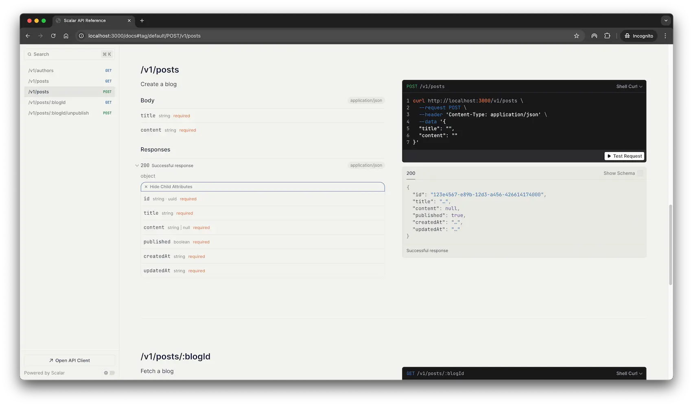

# The Boundaries of TypeScript Testing

This repo is accompanying a blog post I wrote on some guidelines that I've learned the hard way with TypeScript unit testing. The blog post is available [here](https://www.dennisokeeffe.com/blog/2025-03-29-the-boundaries-of-typescript-testing).

Please note that this repo is accompanying the blog post and not a fully-fledged project. I've omitted some simple basics that you would normally set up around formatting and linting.

## Overview

The demo application is a Hono repository that follows somewhat follows a controller-service-repository pattern. In general, I have some opinions on some of these abstractions but the abstractions have been made to help demonstrate the testing principles.

## Prerequisites

To run, you will need Docker configured and running on your machine, as well as Node 20+.

## Getting started

For running the actual application.

```bash
cp .env.example .env
npm install
docker compose up -d
npm run dev
```

If you go to `http://localhost:3000/docs`, there is a Scalar OpenAPI application you can use to play around.



For running the tests.

```bash
cp .env.example .env
npm install
npm run test
```

The tests make use of Testcontainers to spin up a Postgres and Valkey database for the tests.

